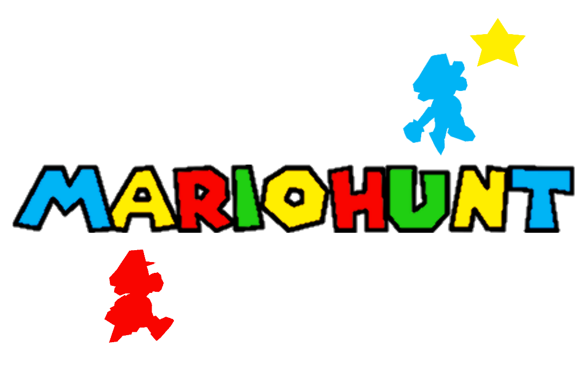

### v1.6 (view changelog [here](changelog.md))

## [Trailer](https://www.youtube.com/watch?v=hyuXu4Bzugs&ab_channel=N64Mario)

Trailer by N64 Mario, logo by N64 Mario and Beyond
 
 
 
A gamemode based off of Blue Beyond's concept. Hunters stop Runners from clearing the game!

Mod for sm64ex-coop
 
 
 
Main Programming by EmilyEmmi, and TroopaParaKoopa

Automatic Doors and Disable Star Spawn Cutscenes by Blocky, and Sunk

Spectator mod by Sprinter05
 
 
 
Spanish Translation made with help from TroopaParaKoopa (I've gotten mixed feedback on the quality, so please report any inaccuracies)

German Translation made by N64 Mario

Brazillian Portuguese Translation made by PietroM
 
 
 
Port of "Shooting Star Summet" by pieordie1 [(here)](https://www.smwcentral.net/?p=section&a=details&id=13275)
 
 
 
# HOW TO USE:
Install like a regular mod (place the MarioHunt folder in either mods folder). The main rules of the game will appear first. To change rules, start the game, and select players, the following commands are available:
 
 
 
Important commands are denoted by "***"

*** /mh: Displays command list. Do /mh [COMMAND] to run the specified command. Do /mh [COMMAND] [PARAMETER] to add parameters. Host/moderator/developer (me) only

*** /mh start [CONTINUE|MAIN|ALT] - Starts the game. Must have at least 1 runner. Add "continue" to skip timer sequence, add "main" to use main save file, and add "alt" to use alt save file (buggy).

*** /mh add [INT] - Adds the specified amount of runners at random. Must have at least 1 hunter remaining after selection.

*** /mh random [INT] - Sets the specified amount of runners total at random. Must have at least 1 hunter remaining after selection.

/mh lives [INT] - Sets amount of lives runners have. Remember that 0 is a life, so /mh runnerlives 1 gives Runners 2 deaths until they lose.

/mh time [NUM] - Sets time runners need to stay in a course in seconds. Note that time is also cut based on existing stars in the level (1:30 for each star)

/mh stars [NUM] - For Star Mode, sets amount of stars runners need to get to leave a course.

/mh category [INT] - Sets number of stars runners need to collect total. Changing this opens doors, disables infinite stairs, etc.

*** /mh flip [NAME|ID] - Switches team of specified player (or yourself if not specified).

/mh setlife [NAME|ID|INT,INT] - Sets the specified lives for the specified runner (or yourself if not specified).

/mh leave [NAME|ID] - Lets the specified player leave the course (or yourself if not specified).

/mh mode [NORMAL|SWITCH] - Change game mode. In Runner Switch mode, when a runner is defeated, a random hunter becomes a runner.

/mh starmode [ON|OFF] - Toggles using stars to leave a stage as opposed to the timer, like in the old days of MarioHunt.

/mh spectator [ON|OFF] - Toggles hunters' ability to use spectator

/mh pause [NAME|ID|ALL] - Freezes or unfreezes the specified player, yourself if not specified, or all players if specified.

/mh metal [ON|OFF] - Toggles making hunters appear as if they have the metal cap; this does not make them invincible

/mh hack [STRING] - Sets hack; Supported hacks are "vanilla", "Star Road", and "Super Mario 74 (+EE)", case sensitive

/mh weak [ON|OFF] - Toggles cutting players' invulnerability frames in half
 
 
 
In addition, the following commands are available:

/tc [MSG|ON|OFF] - Send message to team only. ON enables this without having to type /tc every time.

/lang [EN|ES|DE|PT-BR] - Switches language. Some command feedback and descriptions are not translated.

/spectate [NAME|ID|OFF] - Hunters only. Spectate the specified player, or unspectate.

/stats - Display stats for all players
 
 
 
Have fun, and please report any bugs.
