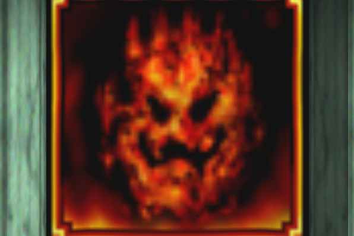
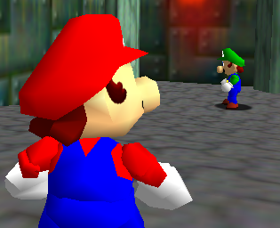
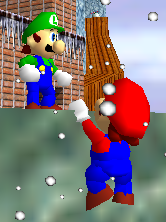
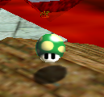
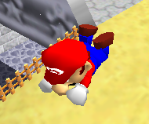

# Advice
This is advice for Normal and Switch mode. These tips should apply regardless of the romhack.

# Runners

## The Hub

Don't let your guard down in hub areas. They are **very dangerous.** Why?
### NO ESCAPE
There is no leaving the hub. If you're in trouble, you can't escape by exiting the course.
### Dead Ends

Inside areas tend to have a lot of dead ends. It's easy to get trapped.
### Where did that bring you? Back to me.
You have to visit the hub **constantly**. It's easy to get attacked here because the Hunters will know you're coming back.

TLDR: Shhhh! Please walk carefully in the hallways!

## How To Not Die

### Avoid Cliffs

**The void kill you instantly.** Just one kick off the ledge and you're DEAD.
Try not to be near cliffs, if possible.
If you're able to Exit Course, you can be a bit less cautious, but you have to exit FAST.

### Just leave.
If you're about to die, just leave.

No, it's not cheating. It says you can leave the course. Even if you're falling, just leave. You'll be healed too, which is nice.

But you may not *always* want to leave. If you're close to getting another star, it might be worth it to stick around a while longer.
But also keep in mind that it's better to not get that star than to risk losing one of your precious lives.

### Healing

Collect coins, obviously. But if you need quick healing in a pinch, the 1-UP Mushroom is your friend.
Collecting this fungus will **fully restore your health**. These are scattered all over dangerous levels, like in LLL.

But if you don't have access to coins, you can always resort to **violence**. Defeating another player will fully heal you, and this goes for Runners, too.
If you're in danger, fighting back might be the best plan.

## Gotta Go Fast

How do you go fast? In vanilla, the answer is Dives.

And also long jumps. But you'll probably want to dive, too.

To dive, press B while running. "I knew that already" you're probably thinking.
But have you tried *jumping*? ... while diving, I mean. If you jump, then quickly press B, you'll do a dive that'll also have some vertical speed.

You can even do a dive out of a sideflip to fly straight over Hunters! Sort of like that one scene from Cars 3.

### OMM Rebirth

But what if you prefer to play with Issac ever-popular OMM Rebirth?
You can't dive in that!
Generally, you'll want to **Roll** by crouching and mashing B.
Roll down a slope, and you'll go even faster.

But what if there was a way to go fast in the *air*? Well, let me introduce you to the most broken tech in gaming history (citation needed)...

### Roll Conservation (idk what this tech is actually called)

This tech lets you to travel INSANE distances in the air. Here's how to do it:

1: Roll and build up speed.

2: Throw Cappy.

3: Quickly jump and hold Y to spin.

Now you have all of the speed of a downward roll, but in the air. Better yet, if you jump as you hit the ground, you **still keep the speed**.
It travels so far, you can collect Mario Wings To The Sky without the cannon or wing cap!

# Hunters

## How To Beat People Up More Efficiently

To deal the most damage, use the **Ground Pound**.
It deals a whopping **three** points of damage.
It also hits people in the air!

But there's a faster way of beating people up, and that's the power of **gravity**.
Use a swift kick to knock Runners off cliffs.
They'll either take fall damage, or fall into the void and die instantly.

You can also grab the Metal Cap to deal double damage. Combine this with a Ground Pound, for **six points of damage**. That's almost the entire health bar!

### OMM Rebirth

Cappy is also a great murder weapon.
Type /omm, and set him to *Damage*.
He'll deal two damage to any Runners he hits, and you can use the D-Pad to home in.
