# Level Breakdown
In this section, I will go over every course in vanilla Super Mario 64, and give advice for the Runners for each. Sometimes, I will give specific advice for when using OMM Rebirth.

## INDEX
### [The Castle](#the-castle-1)
- [Painting/Victory Skip](#paintingvictory-skip)
- [Exiting Course](#exiting-course)
- [The Stars](#the-stars)
- [Catching Mips](#catching-mips)
### [Bob-Omb Battlefield (BoB)](#bob-omb-battlefield-bob-1)
- [Big Bob-Omb On The Summit](#big-bob-omb-on-the-summit)
- [Footrace With Koopa The Quick](#footrace-with-koopa-the-quick)
- [Shoot To The Island In The Sky](#shoot-to-the-island-in-the-sky)
- [Find The 8 Red Coins](#find-the-8-red-coins)
- [Mario Wings To The Sky](#mario-wings-to-the-sky)
- [Behind Chain Chomp's Gate](#behind-chain-chomps-gate)
- [100 Coins Star (BoB)](#100-coins-star-bob)
### [Whomp's Fortress (WF)](#whomps-fortress-wf-1)
- [Chip Off Whomp's Block](#chip-off-whomps-block)
- [To The Top Of The Fortress](#to-the-top-of-the-fortress)
- [Shoot Into The Wild Blue](#shoot-into-the-wild-blue)
- [Red Coins On The Floating Isle](#red-coins-on-the-floating-isle)
- [Fall Onto The Caged Island](#fall-onto-the-caged-island)
- [Blast Away The Wall](#blast-away-the-wall)
- [100 Coins Star (WF)](#100-coins-star-wf)
### [Jolly Roger Bay (JRB)](#jolly-roger-bay-jrb-1)
- [Plunder In The Sunken Ship](#plunder-in-the-sunken-ship)
- [Can The Eel Come Out To Play?](#can-the-eel-come-out-to-play)
- [Treasure Of The Ocean Cave](#treasure-of-the-ocean-cave)
- [Red Coins On The Ship Afloat](#red-coins-on-the-ship-afloat)
- [Blast To The Stone Pillar](#blast-to-the-stone-pillar)
- [Through The Jet Stream](#through-the-jet-stream)
- [100 Coins Star (JRB)](#100-coins-star-jrb)
### [Cool, Cool Mountain (CCM)](#cool-cool-mountain-ccm-1)
- [Slip Slidin' Away](#slip-slidin-away)
- [Li'l Penguin Lost](#lil-penguin-lost)
- [Big Penguin Race](#big-penguin-race)
- [Frosty Slide For 8 Red Coins](#frosty-slide-for-8-red-coins)
- [Snowman's Lost His Head](#snowmans-lost-his-head)
- [Wall Kicks Will Work](#wall-kicks-will-work)
- [100 Coins Star (CCM)](#100-coins-star-ccm)
### [Big Boo's Haunt (BBH)](#big-boos-haunt-bbh-1)
- [Go On A Ghost Hunt](#go-on-a-ghost-hunt)
- [Ride Big Boo's Merry-Go-Round](#ride-big-boos-merrygoround)
- [Secret Of The Haunted Books](#secret-of-the-haunted-books)
- [Seek The 8 Red Coins](#seek-the-8-red-coins)
- [Big Boo's Balcony](#big-boos-balcony)
- [Eye To Eye In The Secret Room](#eye-to-eye-in-the-secret-room)
- [100 Coins Star (BBH)](#100-coins-star-bbh)
### [The Princess's Secret Slide (PSS)](#the-princesss-secret-slide-pss-1)
- [The Slide's Secret](#the-slides-secret)
- [Speedy Sliding](#speedy-sliding)
### [Tower Of The Wing Cap (TotWC)](#tower-of-the-wing-cap-totwc-1)
- [Flight For 8 Red Coins](#flight-for-8-red-coins)
### [The Secret Aquarium (SA)](#the-secret-aquarium-sa-1)
- [Swimming With The Coins](#swimming-with-the-coins)
### [Bowser In The Dark World (BitDW)](#bowser-in-the-dark-world-bitdw-1)
- [Red Coins Of The Dark](#red-coins-of-the-dark)
### [Hazy Maze Cave (HMC)](#hazy-maze-cave-hmc-1)
- [Swimming Beast In The Cavern](#swimming-beast-in-the-cavern)
- [Elevate For 8 Red Coins](#elevate-for-8-red-coins)
- [Metal-Head Mario Can Move!](#metalhead-mario-can-move)
- [Navigating The Toxic Maze](#navigating-the-toxic-maze)
- [A-Maze-Ing Emergency Exit](#amazeing-emergency-exit)
- [Watch For Rolling Rocks](#watch-for-rolling-rocks)
- [100 Coins Star (HMC)](#100-coins-star-hmc)
### [Lethal Lava Land (LLL)](#lethal-lava-land-lll-1)
- [Boil The Big Bully](#boil-the-big-bully)
- [Bully The Bullies](#bully-the-bullies)
- [8-Coin Puzzle With 15 Pieces](#8coin-puzzle-with-15-pieces)
- [Red-Hot Log Rolling](#redhot-log-rolling)
- [Hot-Foot-It Into The Volcano](#hotfootit-into-the-volcano)
- [Elevator Tour In The Volcano](#elevator-tour-in-the-volcano)
- [100 Coins Star (LLL)](#100-coins-star-lll)
### [Shifting Sand Land (SSL)](#shifting-sand-land-ssl-1)
- [In The Talons Of The Big Bird](#in-the-talons-of-the-big-bird)
- [Shining Atop The Pyramid](#shining-atop-the-pyramid)
- [Inside The Ancient Pyramid](#inside-the-ancient-pyramid)
- [Stand Tall On The Four Pillars](#stand-tall-on-the-four-pillars)
- [Free Flying For 8 Red Coins](#free-flying-for-8-red-coins)
- [Pyramid Puzzle](#pyramid-puzzle)
- [100 Coins Star (SSL)](#100-coins-star-ssl)
### [Dire, Dire Docks (DDD)](#dire-dire-docks-ddd-1)
- [Board Bowser's Sub](#board-bowsers-sub)
- [Chests In The Current](#chests-in-the-current)
- [Pole-Jumping For Red Coins](#polejumping-for-red-coins)
- [Through The Jet Stream](#through-the-jet-stream)
- [The Manta Ray's Reward](#the-manta-rays-reward)
- [Collect The Caps...](#collect-the-caps)
- [100 Coins Star (DDD)](#100-coins-star-ddd)
### [Cavern Of The Metal Cap (CotMC)](#cavern-of-the-metal-cap-cotmc-1)
- [Coins In The Cavern](#coins-in-the-cavern)
### [Vanish Cap Under The Moat (VCUtM)](#vanish-cap-under-the-moat-vcutm-1)
- [Red Coin Acrobatics](#red-coin-acrobatics)
### [Bowser In The Fire Sea (BitFS)](#bowser-in-the-fire-sea-bitfs-1)
- [8 Flaming Coins](#8-flaming-coins)
### [Snowman's Land (SL)](#snowmans-land-sl-1)
- [Snowman's Big Head](#snowmans-big-head)
- [Chill With The Bully](#chill-with-the-bully)
- [In The Deep Freeze](#in-the-deep-freeze)
- [Whirl From The Freezing Pond](#whirl-from-the-freezing-pond)
- [Shell Shreddin' For Red Coins](#shell-shreddin-for-red-coins)
- [Into The Igloo](#into-the-igloo)
- [100 Coins Star (SL)](#100-coins-star-sl)
### [Wet-Dry World (WDW)](#wetdry-world-wdw-1)
- [Shocking Arrow Lifts!](#shocking-arrow-lifts)
- [Top O' The Town](#top-o-the-town)
- [Secrets In The Shallows & Sky](#secrets-in-the-shallows--sky)
- [Express Elevator--Hurry Up!](#express-elevatorhurry-up)
- [Go To Town For Red Coins](#go-to-town-for-red-coins)
- [Quick Race Through Downtown!](#quick-race-through-downtown)
- [100 Coins Star (WDW)](#100-coins-star-wdw)
### [Tall, Tall Mountain (TTM)](#tall-tall-mountain-ttm-1)
- [Scale The Mountain](#scale-the-mountain)
- [Mystery Of The Monkey Cage](#mystery-of-the-monkey-cage)
- [Scary 'Shrooms, Red Coins](#scary-shrooms-red-coins)
- [Mysterious Mountainside](#mysterious-mountainside)
- [Breathtaking View From Bridge](#breathtaking-view-from-bridge)
- [Blast To The Lonely Mushroom](#blast-to-the-lonely-mushroom)
- [100 Coins Star (TTM)](#100-coins-star-ttm)
### [Tiny-Huge Island (THI)](#tinyhuge-island-thi-1)
- [Pluck The Piranha Flower](#pluck-the-piranha-flower)
- [The Tip Top Of The Huge Island](#the-tip-top-of-the-huge-island)
- [Rematch With Koopa The Quick](#rematch-with-koopa-the-quick)
- [Five Itty Bitty Secrets](#five-itty-bitty-secrets)
- [Wiggler's Red Coins](#wigglers-red-coins)
- [Make Wiggler Squirm](#make-wiggler-squirm)
- [100 Coins Star (THI)](#100-coins-star-thi)
### [Tick Tock Clock (TTC)](#tick-tock-clock-ttc-1)
- [Roll Into The Cage](#roll-into-the-cage)
- [The Pit And The Pendulums](#the-pit-and-the-pendulums)
- [Get A Hand](#get-a-hand)
- [Stomp On The Thwomp](#stomp-on-the-thwomp)
- [Timed Jumps On Moving Bars](#timed-jumps-on-moving-bars)
- [Stop Time For Red Coins](#stop-time-for-red-coins)
- [100 Coins Star (TTC)](#100-coins-star-ttc)
### [Rainbow Ride (RR)](#rainbow-ride-rr-1)
- [Cruiser Crossing The Rainbow](#cruiser-crossing-the-rainbow)
- [The Big House In The Sky](#the-big-house-in-the-sky)
- [Coins Amassed In A Maze](#coins-amassed-in-a-maze)
- [Swingin' In The Breeze](#swingin-in-the-breeze)
- [Tricky Triangles!](#tricky-triangles)
- [Somewhere Over The Rainbow](#somewhere-over-the-rainbow)
- [100 Coins Star (RR)](#100-coins-star-rr)
### [Wing Mario Over The Rainbow (WMotR)](#wing-mario-over-the-rainbow-wmotr-1)
- [The Rainbow's Red Coins](#the-rainbows-red-coins)
### [Bowser In The Sky (BitS)](#bowser-in-the-sky-bits-1)
- [Skybound Red Coins](#skybound-red-coins)

## The Castle
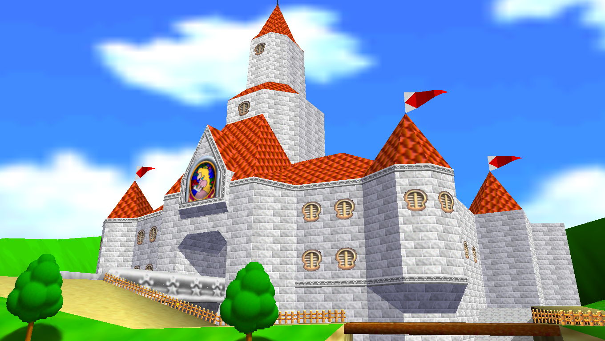

Princess Peach's Castle. Unfortunatly, the Toads and Princess Peach have been sealed within the castle walls by Bowser! It's up to the Runners to stop him and save Princess Peach. And the Toads too, I guess.

If you've read the [advice page](advice.md), you'll know how dangerous this castle is. Luckily, there's some special techniques you can use to gain the upper hand.

### Painting/Victory Skip
By pausing right before entering a painting, then unpausing, you can skip the transition to get into levels faster. Remember that this only works for paintings; other kinds of warps, like for the Secret Aquarium, won't work.

### Exiting Course
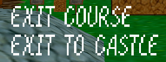

There's two options in the pause menu: "Exit Course" and "Exit To Castle". "Exit Course" will warp you out of the painting or area you entered, while "Exit To Castle" will warp you back to the castle lobby, like in the original Super Mario 64. Be sure to choose whichever one suits your needs! Exit Course will make it easier to enter levels nearby, while Exit To Castle is better suited for fast getaways. Both options will fully restore your health.

You can also use Exit Course to skip the star dance animation. Pause right before grabbing a star or key, then select an option. Not only can you save some time, but this also lets you Exit To Castle right away, saving the walk after getting a Bowser Key. This won't work if you can't Exit Course yet, obviously.

### The Stars
There are five stars hidden in the castle, 3 of which are from Toad. The other 2 can be obtained from Mips The Rabbit in the basement.

- Toad Star 1: By the entrance to Hazy Maze Cave. He appears after collecting 12 stars.
- Toad Star 2: By the stairs in the Upper Floor, across from Tall Tall Mountain. He appears at 25 stars, so he should be there by default if you've been playing a 70 star run.
- Toad Star 3: To the right of Tick Tock Clock. He appears at 35 stars, so he should also be there by default.
- Mips Star 1: In the basement. He appears at 15 stars.
- Mips Star 2: Same location. He appears at 50 stars. Also, he's a bit faster.

### Catching Mips
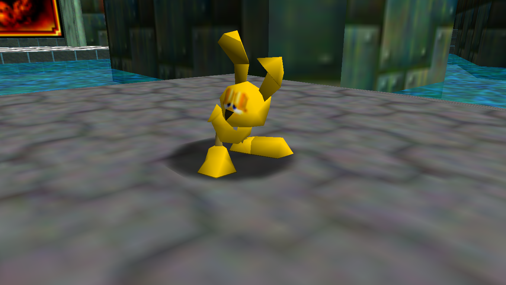

The easiest way to catch Mips is to repeatedly dive as you approach. If you miss him, you'll have to chase him around the basement while the Hunters try to beat you up. In this scenario, try to chase Mips into a dead end and grab him as he turns around.

## Bob-Omb Battlefield (BoB)
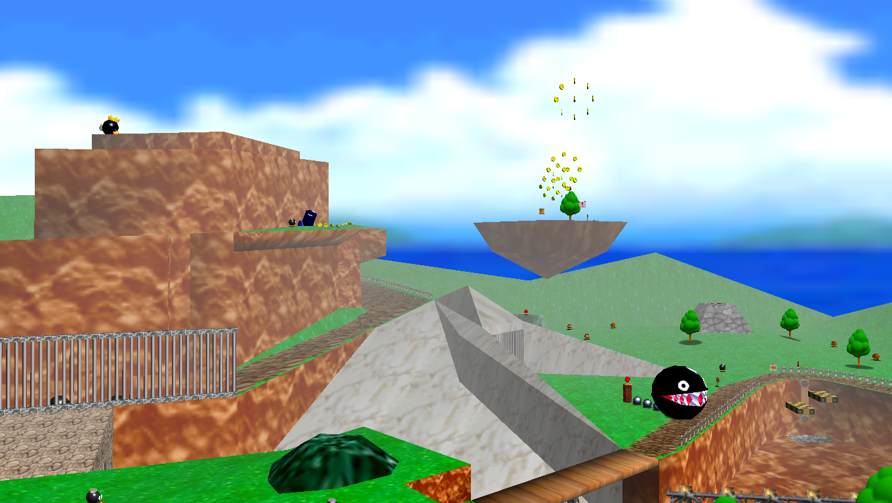

Bob-Omb Battlefield! Strangely upbeat music for a war zone. This is the first course every Runner shall enter. Despite that, this course is no easy stroll.

### Big Bob-Omb On The Summit
Ironically, this is one of the trickiest stars. The King himself poses no threat, but you'll have to dodge many Hunters as you battle atop the summit. I find that most Runners skip this star and go for the Island star instead, which we'll get to later.

### Footrace With Koopa The Quick
You have to select this act to access this star. Koopa The Quick is, ironically, not quick. You should have little issue beating him as long as you don't use a cannon or warp. For an even faster time, try jump kicking up the slope with the Red Coin (this is easier if you hold the joystick halfway, sorry keyboard players). Once you get to the top, you'll probably have to jump off the mountain and climb back up to avoid the onslaught of Hunters.

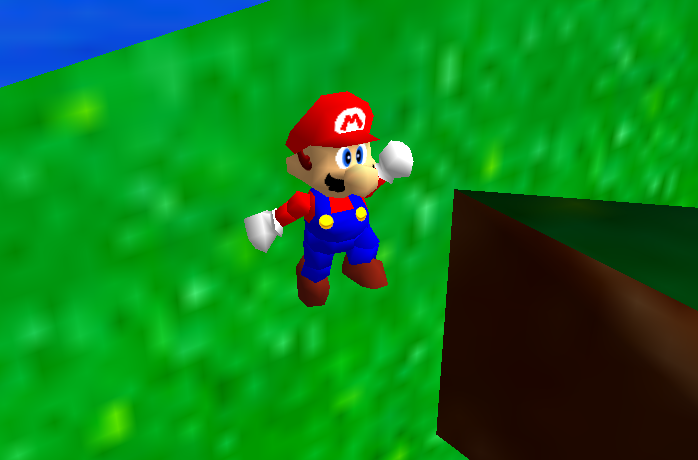

Here's a neat shortcut you can use against Koopa The Quick. Perform a sideflip next to the slope with the Red Coin, and wall jump off of the grassy wall. If you were close enough to the slope, you can grab the ledge and skip a large chunk of the mountain.

### Shoot To The Island In The Sky
This star is impossible without opening the cannon, right? WRONG. Long jump from the very corner of the mountain with enough speed, and you can reach the island for a free star. This also lets you grab the red coin star early.

### Find The 8 Red Coins
Use the technique above to collect all 8 Red Coins early. Don't forget the one behind the gate, below the entrance to the mountain.

### Mario Wings To The Sky
With the vanilla moveset, you can't get this one without the wing cap. But using OMM Rebirth, the [gork jump](advice.md#gork-jump), and some Homing Cappy Throws, this star can be conquered with no wing cap or cannon use at all!

### Behind Chain Chomp's Gate
You can go for this one first if you've got a significant lead or if the Hunters are focused on another player. If you don't, wait for the Hunters to spread out, then go for it.

You can also try performing Bomb Clip to grab this star quickly ([Here](https://www.youtube.com/watch?v=_XydLCf9AGs&ab_channel=Drogie)'s a tutorial I just googled). But if that technique's too tricky, there's actually another technique: The Cork Box Clip.

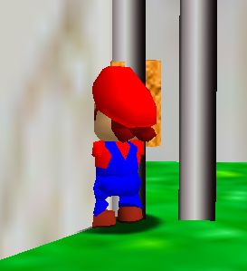

Stand in the bottom left corner of the gate while holding the small box from the start of the level, and press Z. You'll clip

### 100 Coins Star (BoB)
There are 146 coins in this course. Unfortunately, a lot are in the rings in the sky, so you won't be able to get this star on your first visit. I wouldn't go for this star, personally. It doesn't seem worth the time.

## Whomp's Fortress (WF)
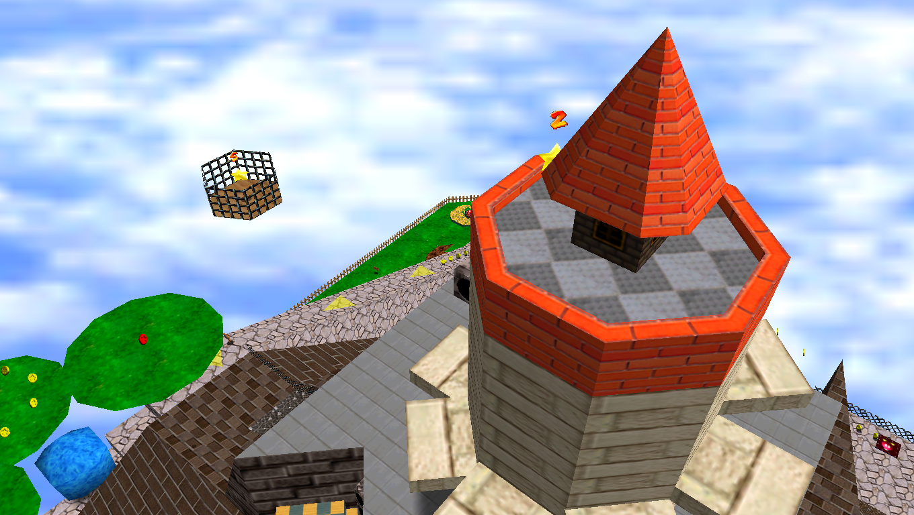

Whomp's Fortress is the second stage, and quite the step up from Bob-Omb Battlefield. Not only is the stage much smaller, but it introduces the threat of bottomless pits- instant death if you aren't careful. This course also has many act-specific stars, so you'll have to reenter more than once.

Unlike BoB, a lot of these stars are very fast. This is a great course for getting stars, despite the risks.

### Chip Off Whomp's Block
A tricky first star, like Big Bob-Omb on the Summit. Your first task is to make your way to the top of the fortress. Going the normal route will require riding an elevator, which will easily let Hunters attack you. Instead, perform a side-flip or triple jump followed by a wall jump next to the Piranha Plant midway up the fortress. You can reach the floating island and skip right to King Whomp.

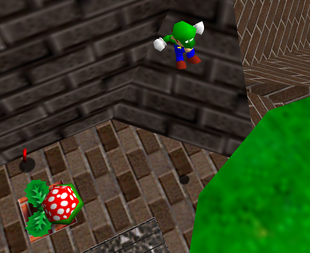

Since this is a boss fight, you'll be at the mercy of Hunters the whole time. However, this fight is trivial if you know this trick. Right when King Whomp tries to crush you, jump and do a Ground Pound. He'll phase right through you, and you'll be able to hit him immediately.

### To The Top Of The Fortress
Take the same route as before, then you half to climb the tower. Jump across the platforms quickly, or do a careful wall jump onto the final platform. This last platform is an elevator, which is why being fast is priority #1. If the Hunters reach the top first, they can simply kick you off and prevent you from reaching the star.

### Shoot Into The Wild Blue
"Shoot?" Yeah, right. Go below the platform with the star and perform a triple jump or side-flip followed by a wall jump to get onto the platform easily. Just be careful- this area is close to the void.

### Red Coins On The Floating Isle
If you took the shortcut, you'll have to go back for the red coins near the rotating bridge. Otherwise, getting this star should be a quick endeavor. Again, be careful near the star, as it's close to the edge of the stage. You should also take this opportunity to get the 100 coin star.

There's also a hidden warp next to the sign near the Thwomps and the Metal Cap. Many players forget about this warp, so be sure to use it to your advantage.

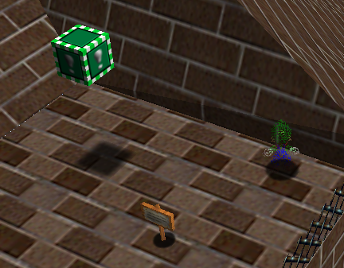

### Fall Onto The Caged Island
Hoot the Owl *can* help you get this star, but it's likely you'll miss due to weird momentum-conservation bugs. Instead, you can simply long jump from the top of the fortress. Or, you could try to go for the notoriously difficult [Owlless](https://ukikipedia.net/wiki/RTA_Guide/Fall_onto_the_Caged_Island#Owlless_.28Standard.29) trick.

### Blast Away The Wall
Show up to this star and talk to the Bob-Omb Buddy, being sure not to get kicked off. From there, run around a bit until you get the chance to get in the cannon (since one of the Hunters probably stole it). Aim for the corner of the wall (there should be a 6 above it). If you have another Runner in the stage with you, they can grab the star to save some time.

Or if you're insane, you can do [cannonless](https://ukikipedia.net/wiki/Cannonless).

### 100 Coins Star (WF)
There are 141 coins in this level. All of these are easily accessible, and because the stage is small, quick to obtain. You can actually get 10 coins from each Whomp- jump on its back five times before destroying it. Show up with a fellow Runner to tackle this star in record time. Also take advantage of the hidden warp to avoid getting kicked off of the stage.

## Tower Of The Wing Cap (TotWC)

The home of the Wing Cap Switch. The Wing Cap is extremely useful for stages such as Lethal Lava Land and Bob-Omb Battlefield. However, this is a very dangerous stage. All the Hunters have to do is fly into you, and you'll fall to your doom!

### Flight For 8 Red Coins
Fly carefully. Wait to enter this stage until the Hunters are distracted, because dodging them whilst collecting the coins is nearly impossible. If you miss any of the Red Coins, you can't go back unless you're using OMM Rebirth. Plus, you'll be trapped with all of the Hunters on a small platform.

... Or are you?

ColbyRayz! discovered that if you fly to edge of the stage, you'll leave the course *without losing a life*. This turns TotWC from a nightmare scenario into a breeze, provided you can pull off the triple jump needed to take off. Now you can even hit the switch and run!

## Jolly Roger Bay (JRB)
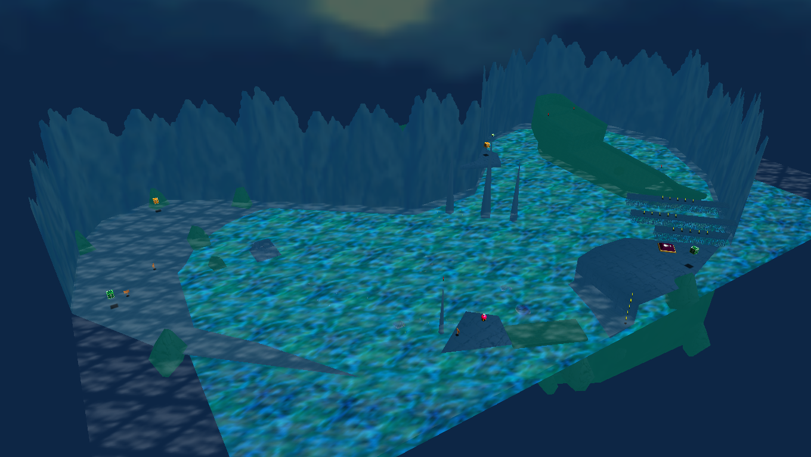

Wait, I thought Cool Cool Mountain was Course 3? Nope, the first water level is, but everyone would prefer to put it off for later. The swimming physics haven't exactly aged well, especially for any poor keyboard players. Water levels in MarioHunt are not fun, because Mario lost his gills in the jump to 3D. Not only does the water's surface heal Runners much slower, but Hunters have an upgraded punch that travels faster. Don't expect smooth sailing, considering the sunken ship.

### Plunder In The Sunken Ship
TERRIBLE. First, push your nose against Unagi, then swim up for air. Hopefully, Unagi moves out of the entrance. After making your way inside, grab the Treasure Chest that's placed away from the others, then grab the rest in a clockwise motion, starting with the one in the top left (when facing towards the other end of the ship).

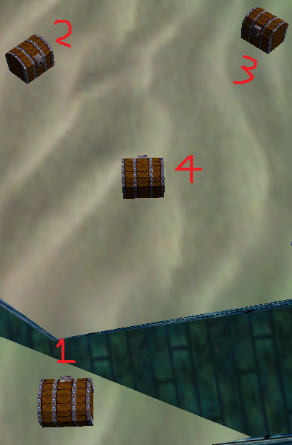

Finally, swim quickly to the box to avoid having to platform. If the Hunters corner you while in the ship, you're done for. Thankfully, the chests don't reset, so you don't have to worry as much about guessing wrong.

If you're using OMM Rebirth, you can simply open the box using Cappy (although the chests will be needed in order to leave).

### Can The Eel Come Out To Play?
INSERT STAR DESCRIPTION

### Treasure Of The Ocean Cave
INSERT STAR DESCRIPTION

### Red Coins On The Ship Afloat
INSERT STAR DESCRIPTION

### Blast To The Stone Pillar
INSERT STAR DESCRIPTION

### Through The Jet Stream
INSERT STAR DESCRIPTION

### 100 Coins Star (JRB)
INSERT STAR DESCRIPTION