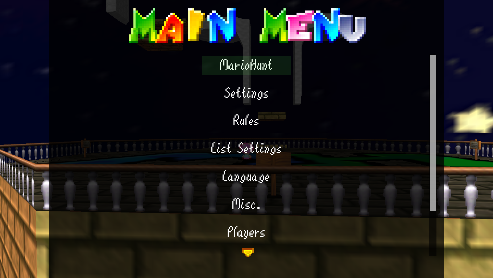

# The Menu
About time I make some menu documentation. The menu can be opened by **Holding L and Pressing Start**, or by typing /mh in the chat with no arguments. This is what it looks like:

As the host, you'll mostly be using the [MarioHunt](#mariohunt) and [Players](#players) tabs. As a player, you'll mostly likely use [Settings](#settings) and [Misc.](#misc)

## Index
### [MarioHunt](#mariohunt-1)
- [Start](#start)
- [Randomize Runners](#randomize-runners)
- [Add Runners](#add-runners)
- [Gamemode](#gamemode)
- [Game Settings](#game-settings-1)
- [Stop](#stop)
### [Game Settings](#game-settings-1)
- [Runner Lives](#runner-lives)
- [Time](#time)
- [Star Mode](#star-mode)
- [Leader Death Timer](#leader-death-timer)
- [Category](#category)
- [Defeat Bowser](#defeat-bowser)
- [Auto Game](#auto-game)
- [Nerf Vanish Cap](#nerf-vanish-cap)
- [Allow Spectating](#allow-spectating)
- [Allow 'Stalking'](#allow-stalking)
- [Weak Mode](#weak-mode)
- [Friendly Fire](#friendly-fire)
- [Runner PVP DMG Up](#runner-pvp-dmg-up)
- [Countdown](#countdown)
- [Double Runner Health](#double-runner-health)
- [Void DMG](#void-dmg)
- [Reset to Defaults](#reset-to-defaults)
- [MiniHunt Blacklist](#minihunt-blacklist)
### [Settings](#settings-1)
- WIP
### [Rules](#rules-1)
### [Language](#language-1)
### [Misc.](#misc-1)
- WIP
### [Players](#players-1)
- WIP
### [Stats](#stats-1)

## MarioHunt
This is where all game management takes place. This contains the settings, randomizing runners, and starting the game.
### Start
Starts the game. This is actually a sub-menu with 4 or 2 options depending on the mode. Won't work if there are no Runners.

In Normal/Swap mode:
- **Main:** Starts the game using the main save file.
- **Alt Save:** Starts the game using the alt save file (as opposed to the one loaded by default).
- **Reset Alt Save:** Resets the alt save back to 0 stars, then starts the game. Useful for having many games in a row.
- **Continue:** Starts the game without warping anyone. Use this after stopping the game with [Stop](#stop). Note that this won't warp players out of the lobby, either: jump off of the lobby to warp to Castle Grounds.

In MiniHunt:
- **Random:** Picks stars at random.
- **Campaign:** Picks stars according to the stars selected for the [64 Tour Competition](https://docs.google.com/document/d/1esE29rx2a-LPEdcwzNlI928pZoU1Zcf14E-Hx0XpTms/edit). The campaign was designed with vanilla in mind, so it may play oddly with rom hacks. You can start at any of the 25 stars. Afterward, stars are selected at random.

### Randomize Runners
Randomly selects this amount of players to be Runners. **For number options such as this, use left and right to select a number, then press A.** Hold X while adjusting to adjust by 10. Select "auto" to make 40% of the lobby become Runners, EXCEPT when there's 5 players, in which case only 1 Runner is selected.

Full details for a 16 player lobby:

| Players | Runners |
|---------|---------|
| 2-5     | 1       |
| 6-7     | 2       |
| 8-9     | 3       |
| 10-12   | 4       |
| 13-14   | 5       |
| 15-16   | 6       |

### Add Runners
Randomy *adds* this amount of players to be Runners, without affecting the existing Runners. Selecting "auto" adds an "ideal" amount of Runners, like the formula above. If there are already an ideal amount, or more than the ideal amount, nothing happens.

### Gamemode
Sets the gamemode. Options are Normal, Swap, and Mini. Normal and Swap are described [here](rules.md), while MiniHunt is described [here](mini.md).

### Stop
Stops the game. Use this if an emergency happens. The game can then be started again with **Continue** in the Start submenu.

## Game Settings
Contains every single setting. Has many customization options.

### Runner Lives
Sets the lives each Runner has. This doesn't change mid-game; use the [Players](#players-1) menu for that. 0 lives is 1 life (works like Mario 64). Also, there is no way for Runners to gain extra lives during a game. This is 1 for Normal mode and 0 for Swap and MiniHunt.

### Time
In Normal/Swap mode: Changes how long Runners must wait to leave a level. 4:00 by default.

In MiniHunt: Changes how long the game lasts. 5:00 by default.

### Star Mode
Changes the **Time** options to **Stars**. This lets Runners leave only after collecting a certain amount of stars. 2 by default. (Not available in MiniHunt)

### Leader Death Timer
Toggles if the leading player in MiniHunt has a death timer, which starts at 30 seconds and increases when collecting coins and 1ups. Used for balance. ON by default. (MiniHunt only)

### Category
The stars Runners must collect to win or to face Bowser. Once this amount of stars are collected, doors are opened automatically and the endless stairs are disabled. Set to Any% to allow skips. The default option depends on the rom hack, with 70 Star being the default for vanilla and Any% being the default if the hack is not directly supported. (Not available in MiniHunt)

### Defeat Bowser
Modifies the category. When disabled, Runners win upon collecting the needed amount of stars and do not have to fight Bowser at all. Any% and 0 Star cannot be used when this is disabled. ON by default. (Not available in MiniHunt)

### Auto Game
Automatically starts games with the specified amount of Runners, or sets Runners automatically if "auto" is selected. OFF by default.

### Nerf Vanish Cap
Nerfs the vanish cap by requiring the user to hold B to activate its abilities, which also drains its time faster. Used for balance. ON by default.

### Allow Spectating
Allows Hunters to spectate using /spectate. ON by default.

### Allow 'Stalking'
Allows any player, Runners included, to warp to any level a Runner is in using /stalk. There is a 5 second frozen timer when used. OFF by default, except when playing B3313 or Ztar Attack 2.

### Weak Mode
Halves invincibilty frames for all players. OFF by default.

### Friendly Fire
Allows members of the same team to attack each other. Can be set to None, Runners, Hunters, or both teams. This is None by default for Standard modes and Runners by default for MiniHunt.

### Runner PVP DMG Up
Makes Runners take more damage when attacked by other players. OHKO makes Runners die in one hit from a player attack. 0 by default for Standard modes and 2 by default for MiniHunt.

### Countdown
The time until Hunters can chase the Runners at the start of the game. 10 seconds by default. (Not available in MiniHunt)

### Double Runner Health
Gives Runners 16 points of health instead of 8. May behave strangely with mods such as OMM Rebirth. OFF by default.

### Void DMG
The damage players take from falling to the void or quicksand. If the player survives, they are sent to the last flat surface they were above. Set to OHKO for vanilla behavior. 3 by default.

### Reset to Defaults
Resets all options to their defaults, which depends on the mode and hack.

### MiniHunt Blacklist
A submenu for managing the blacklist of stars for MiniHunt. Lists every course in the game, and each course is its own submenu allowing each individual star to be toggled. Select "Toggle All" to toggle all stars for a stage, or press X while selecting the stage in the menu. At the bottom you may:
- Load your blacklist (done automatically if you're the host and the blacklist is saved)
- Save your blacklist (seperate for each hack)
- Reset the blacklist to the default
- List all blacklisted stars

## Settings
WIP

## Rules
Lists the rules for the game. This is dynamic, and changes depending on the settings.

## List Settings
Lists all of the game settings. Settings set to their default option, if that default option is OFF or ON, will not be displayed (with the exception of Nerf Vanish Cap.)

## Language
Changes the language for all text. Some text may not change due to lacking a translation. This will be set by default depending on your Coop settings if your language is supported.

## Misc.
WIP

## Players
WIP

## Stats
List stats for every player in the lobby. You can sort stats by pressing A on that stat, and sort from high to low or low to high. The following stats are included:
- **Wins:** Times the player has won as a Runner in Standard modes.
- **Wins (MiniHunt/pre v2.3):** Times the player has won as a Runner in MiniHunt. Since these options were not seperate until version 2.3, all wins before that version are also counted here.
- **Wins (Hard Mode):** Like Wins, but when playing in Hard Mode.
- **Wins (Hard Mode, MiniHunt/pre v2.3):** Like Wins (MiniHunt/pre v2.3), but when playing in Hard Mode.
- **Wins (Extreme Mode):** Like Wins, but when playing in Hard Mode.
- **Wins (Extreme Mode, MiniHunt/pre v2.3):** Like Wins (MiniHunt/pre v2.3), but when playing in Extreme Mode.
- **Kills**: Times the player has defeated another player (in-game)
- **Max Kill Streak**: Maximum amount of players the player has defeated in quick succession (in-game)
- **Maximum stars in one game of MiniHunt**: Exactly what it says on the tin.
- **64 Tour Placement**: Placement in the 64 Tour Competition, which was held way back.