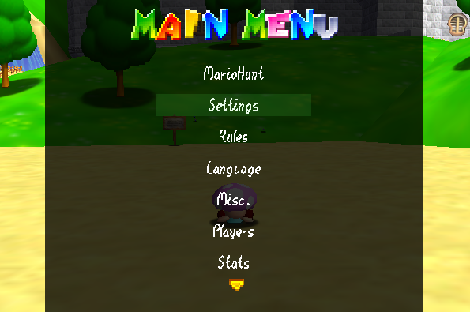

# Running a Game
**FIRST: If you are playing in one of the Standard modes (Normal and Switch) make sure you start with an empty save file!** Unless you're continuing a past game, of course. Don't worry about this with MiniHunt.

Previously, you had to type commands for every single thing. However, thanks to Blocky, there is now a built-in menu that can do it instead. If you would like to know the commands anyway, check [here](commands.md).

Setting up a game is a simple 3-step process.
## Step 1: Settings
First: Type /mh, or hold L and press START, to open the Main Menu. Select MarioHunt, then Game Settings.

Here are the settings you will most likely want to change:

**Runner Lives:** Set the amount lives Runners have.
Remember that this is based on Mario 64 rules; so setting this to 1 will have Runners lose after dying **twice**, since game over occurs at -1 lives.
This is actually not in Game Settings, but in the MarioHunt menu.

**Time:** Sets the amount of time runners have to wait to leave a course OR the amount of time MiniHunt lasts (in seconds).
This is 4 minutes by default.

**Gamemode:** Change the game mode. Select 2 for MiniHunt, and 1 for Switch Mode.
For standard MarioHunt, select 0 (default).

**Reset To Defaults:** Changed too many settings? This will reset everything back to default (including the gamemode).

**Auto Game:** Feeling lazy? In MiniHunt, turn this on and new games will be started **automatically!** It'll even pick a good amount of Runners for you if you select ANY (located left of 0).
Now you can go eat lunch or something (though I would have at least one moderator on to handle any rude players).

**Category:** If you want a shorter game, try a different category!
This uses Speedrunner Terminology™. The default is a **70 star run**. Other common categories include:
  - 0 star: Play all Bowser stages.
  - 1 star: Play all Bowser stages, plus Board Bowser's Sub.
  - 16 star: Get 15 stars, enter DDD and get Board Bowser's Sub, then enter BITS.
  - 31 star: Play normally until after BITFS, then skip right to BITS.
  - 50 star: Play normally until unlocking the Top Castle Floor, then skip to BITS.
  - 120 star: Get every star in the game! You can't fight Bowser until you get every last one. Not for the faint of heart!
But you don't have to play these categories. You can try, say, 8 stars. Or 42 stars. Or even 78 stars. Everything should work as intended.

Some of these categories normally require glitches. However, MarioHunt will automatically open doors and deactivate the Infinite Stairs so that no glitches are required.
(Imagine trying to do Mips Clips with 7 players trying to beat you up...)
But what if you do want glitches? Set the category to ANY. This will activate an **any% run**, where anything goes.

Once that's all handled...
## Step 2: Picking teams
Now it's time to decide who gets to be Runner.
First, go to the MarioHunt menu and use **Randomize Runners** with however many you wish.

Now you're ready to- wait, hold on, what if someone wants to *not* be Runner?
Well then, navigate to the Players menu and select their name. Then select the **Flip Team** option.
You can also use this to flip a Hunter to a Runner, if someone *really* wants to be Runner.

If you're sure everyone is happy with their teams, it's time to...
## STEP 3: START THE GAME!!!
Go to the MarioHunt menu, select Start, and select an option (usually "Main" or "Start"). That's it!

But don't forget that you can do stuff mid-game, too. If there aren't enough Runners, use **Add Runners** to add more runners at random.
You can also use **Flip Team** in case someone loses their role by disconnecting.

That's it! If you want to know how to play, check the [MarioHunt rules](rules.md) or [MiniHunt rules](mini.md).